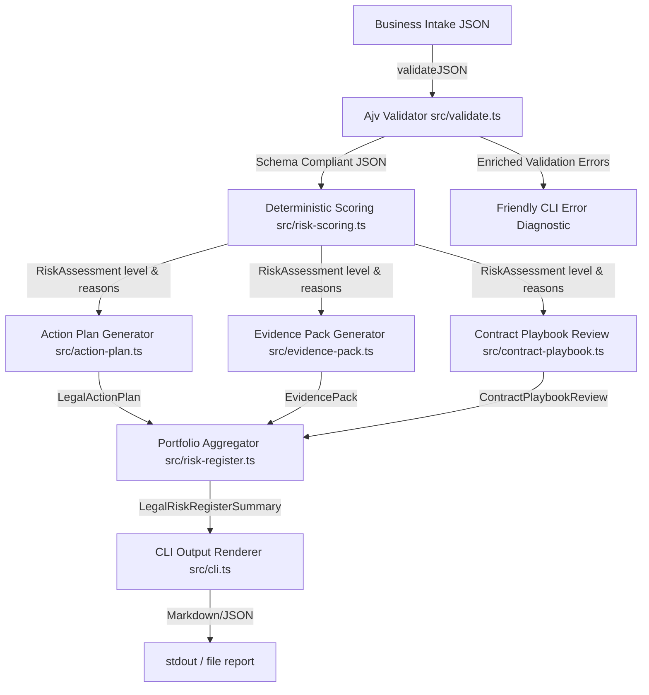

# Product Improvement Plan: AI SaaS Legal Operations Starter Kit

This document provides a comprehensive analysis of the [@sebastianfoerste/ai-saas-legal-ops-starter-kit](file:///Users/sebastian/Developer/ai-saas-legal-ops-starter-kit) repository and defines a practical engineering and product roadmap to elevate it from a strong portfolio showcase into an enterprise-grade legal operations tool.

---

## Section 1: Executive Diagnosis

### What the App Currently Proves Well
1. **Structured Intake Validation**: Expressing unstructured intake forms as machine-readable JSON schemas (using Ajv) establishes that legal teams can prevent garbage data from reaching their triage queue.
2. **Deterministic Triage Routing**: Implementing rules-based TypeScript scoring shows that contract reviews and launches can be triaged programmatically without expensive human-only queues.
3. **Multi-Framework Mapping**: Programmatic alignment of input fields to DORA, GDPR, and the EU AI Act proves that compliance can be tracked continuously rather than assessed manually during launch audits.
4. **Clean Engineering Standards**: A fully typed TypeScript codebase, high test coverage, and strict linting show production-grade standards appropriate for AI-native SaaS companies.

### What the App Does Not Yet Prove
1. **Interactive Review Cycles**: The system lacks an interface (such as a web application or interactive CLI) for a business user to correct validation errors or a lawyer to log custom overrides.
2. **State and Persistence**: Payloads and matter reviews are evaluated in-memory. The system has no database, no versioned state machine for approvals, and no vector-backed historical precedent retrieval.
3. **Immutable Audit Trails**: The legal risk registry lacks cryptographic validation or signature models proving that approvals are immutable.
4. **Dynamic Rule Configuration**: Rules are hardcoded in TypeScript. Adjusting a threshold requires a software release rather than a policy configuration change.

### What Would Make It Materially More Impressive
To capture the attention of engineering leaders, founders, and General Counsel, the starter kit should evolve into an **active legal operating layer**:
- An interactive command-line wizard or a lightweight React/Next.js dashboard to complete intakes.
- Configurable rules loaded from local JSON/YAML policy documents.
- Precedent-matching capability comparing incoming custom clauses against standard fallbacks using vector-similarity or exact substring distance.
- Authenticated state transitions for reviewer sign-offs and immutable PDF/Markdown audit log generation.

---

## Section 2: Current Architecture Summary

The data pipeline runs sequentially from inputs to structured reports:



### Components and Data Flows
1. **Validation Layer ([src/validate.ts](file:///Users/sebastian/Developer/ai-saas-legal-ops-starter-kit/src/validate.ts))**: Checks custom payloads against defined [schemas/](file:///Users/sebastian/Developer/ai-saas-legal-ops-starter-kit/schemas). Returns custom structured warnings containing detailed descriptions and policy links.
2. **Risk Scoring Layer ([src/risk-scoring.ts](file:///Users/sebastian/Developer/ai-saas-legal-ops-starter-kit/src/risk-scoring.ts))**: Compiles a registry of `RiskRule` objects. Evaluates incoming properties (regulated status, data categories, subprocessor locations) and determines risk ratings (`low`, `medium`, `high`, `escalate`).
3. **Action Planning Layer ([src/action-plan.ts](file:///Users/sebastian/Developer/ai-saas-legal-ops-starter-kit/src/action-plan.ts))**: Takes the scoring output and infers next actions, blockers, follow-ups, and required approvals (e.g. GC, DPO, or commercial lead).
4. **Evidence Collection Layer ([src/evidence-pack.ts](file:///Users/sebastian/Developer/ai-saas-legal-ops-starter-kit/src/evidence-pack.ts))**: Compiles structured evidence records aligned with regulatory frameworks (GDPR, EU AI Act, DORA, NIST AI RMF, ISO/IEC 42001).
5. **Contract Playbook Layer ([src/contract-playbook.ts](file:///Users/sebastian/Developer/ai-saas-legal-ops-starter-kit/src/contract-playbook.ts))**: Compares raw non-standard terms against keyword-mapped rules to recommend fallback clause wording.
6. **Portfolio Register Layer ([src/risk-register.ts](file:///Users/sebastian/Developer/ai-saas-legal-ops-starter-kit/src/risk-register.ts))**: Aggregates matters, calculates due dates, tracks overdue items, and compiles recommended actions.
7. **CLI Shell ([src/cli.ts](file:///Users/sebastian/Developer/ai-saas-legal-ops-starter-kit/src/cli.ts))**: Serves as the user entry point, routing calls to subcommands (`validate`, `score`, `plan`, `evidence`, `register`, `template`) or executing the standard demo.

---

## Section 3: Strengths

### 1. Legal Product Thinking
- **Product-Driven Legal Mindset**: The system addresses the real problem of manual contract triage by treating legal constraints as code.
- **Actionable Outputs**: Rather than returning a generic score, it generates actionable steps (approvals, blockers, evidence checklist).

### 2. Technical Implementation
- **Strict Typing**: The entire codebase utilizes structured TypeScript models, ensuring compiler safety.
- **Ajv Integration**: Leverages standard JSON schema validation to enforce formatting rules.

### 3. Testing
- **Vitest Suite**: Standardized, rapid assertions covering schema compliance, scoring engines, registers, and subcommands.
- **Synthetic Examples**: Clear mock payloads matching real-world scenarios.

### 4. Documentation
- **Playbooks and Policies**: Comprehensive markdown policies in [policies/](file:///Users/sebastian/Developer/ai-saas-legal-ops-starter-kit/policies) define clear boundaries for human-in-the-loop oversight and public data safety.

### 5. Recruiter & Founder Signaling
- **High Technical Credibility**: Proves that a legal generalist or developer can design machine-readable legal policies, separating the candidate from candidates writing simple prompt-engineering wrappers.

### 6. Public Safety & Compliance
- **Synthetic Integrity**: All names, domains, and data entries are mock-safe, avoiding confidential or privileged disclosures.

---

## Section 4: Gaps and Weaknesses

1. **Product Gaps**: No dynamic rule overrides or state persistence. Lawyers cannot mark a blocker as "Resolved with GC exception" and save it.
2. **UX Gaps**: Visual output is command-line only. A recruiter looking for high-status visual signaling cannot see visual mockups.
3. **Legal Domain Depth Gaps**: Lack of granular DORA ICT outsourcing registries, copyright compliance, or EU AI Act high-risk classification criteria.
4. **Technical Architecture Gaps**: Rules engine executes globally without caching. No persistence layer (DB or JSON local storage).
5. **Test Coverage Gaps**: No snapshot tests for rendered markdown outputs.
6. **Data Model Gaps**: Playbooks do not track versions or track updates to clause fallbacks.
7. **CLI & Demo Gaps**: Lacks an interactive mode for live walkthroughs.
8. **Documentation Gaps**: No architecture visualizations or quickstart scripts.
9. **Portfolio Presentation Gaps**: Pinned repository details are text-heavy.
10. **Security & Public Safety Gaps**: Validation does not sanitize input strings to prevent shell or code injection.

---

## Section 5: Highest ROI Improvements

| Rank | Title | Why It Matters | Current Evidence | Proposed Change | Affected Files | Effort | Reviewer Impact | Tests Needed | Priority |
| :--- | :--- | :--- | :--- | :--- | :--- | :--- | :--- | :--- | :--- |
| 1 | **Configurable Policy Loader** | Decouples legal rules from TypeScript code. | `src/risk-scoring.ts` is hardcoded. | Load custom `RiskRule` properties from a local JSON policy file. | `src/risk-scoring.ts` | Medium | High | Verify custom rule parsing. | Now |
| 2 | **Interactive Intake Wizard** | Provides interactive feedback. | CLI only parses static files. | Add interactive inputs using standard Node readline. | `src/cli.ts` | Medium | High | Mock stdin interactions. | Now |
| 3 | **State & Persistent History** | Shows how matter states transition. | Matters are evaluated in-memory. | Implement local JSON file storage mapping matters by ID. | `src/risk-register.ts` | Medium | Medium | Test status write/read. | Next |
| 4 | **Framework Coverage Expansion** | Improves legal operations credibility. | `src/evidence-pack.ts` has limited keywords. | Add explicit EU AI Act High-Risk classifications. | `src/evidence-pack.ts` | Small | High | Assert AI Act status rules. | Now |
| 5 | **Validation Error Recommendations** | Enhances self-serve usability. | `src/validate.ts` output is simple. | Map schema errors to detailed remediation tips. | `src/validate.ts` | Small | High | Test invalid schema error messages. | Now |
| 6 | **DORA Exit Strategy Validation** | Meets financial services outsourcing compliance. | Scans basic sectors only. | Refine checks for documented exit strategy in DORA scopes. | `src/risk-scoring.ts` | Small | Medium | Test exitStrategy flags. | Now |
| 7 | **Copyright Safety Checks** | Key issue for generative AI model reviews. | AI vendor terms are very simple. | Raise warnings if AI model terms lack copyright indemnity. | `src/risk-scoring.ts` | Small | High | Test copyright safety rules. | Now |
| 8 | **Weak Copyleft Detection** | Adds legal depth to open-source triaging. | Only searches strong copyleft. | Detect weak copyleft licenses (MPL, EPL, EUPL). | `src/risk-scoring.ts` | Small | Medium | Test MPL/EPL triggers. | Now |
| 9 | **Interactive CLI Help Command** | Eases CLI exploration. | Help text is static. | Implement a beautiful CLI menu system. | `src/cli.ts` | Small | High | Test help CLI commands. | Now |
| 10 | **Approved Tool Registry Integration** | Models the typical legal ops approved list. | Approved list is inline strings. | Load permitted tools from `policies/approved-tools.json`. | `src/risk-scoring.ts` | Medium | Medium | Test registry matches. | Next |
| 11 | **Approval State Machine** | Represents business workflow. | Approvals are simple lists. | Add state machine logic (`pending_approval`, `approved`, `escalated`). | `src/action-plan.ts` | Medium | High | Test state transitions. | Next |
| 12 | **Precedent Vector-Store Mock** | Demonstrates semantic search capability. | Playbook rules use keyword search. | Mock local semantic matching for clauses. | `src/contract-playbook.ts` | Large | High | Test precedent accuracy. | Later |
| 13 | **Snapshot Testing** | Prevents visual report regressions. | Render outputs are not verified. | Add markdown output snapshot tests. | `tests/cli.test.ts` | Small | Medium | Snapshot test outputs. | Next |
| 14 | **PDF/HTML Exporter** | Production-ready deliverable. | Output is Console/Markdown. | Generate formatted HTML/CSS reports. | `src/cli.ts` | Medium | Medium | Test PDF/HTML generation. | Next |
| 15 | **GitHub Action Check Verification** | Proves CI/CD gate reliability. | No automated check workflow. | Add custom linting and validation CI checks. | `.github/workflows/ci.yml` | Small | Medium | CI execution. | Now |

---

## Section 6: Product Roadmap

### Phase 1: Sharp & Credible Demo (Now)
- **Objective**: Harden existing TypeScript rules, validation messages, and CLI subcommands.
- **Deliverables**:
  - Structured error recommendations in `src/validate.ts`.
  - Refactored rules engine in `src/risk-scoring.ts` with custom DORA exit strategy and copyright safety rules.
  - Interactive subcommands in `src/cli.ts`.
- **Acceptance Criteria**: All unit tests pass, command-line inputs validate dynamically, and help texts are fully documented.

### Phase 2: Persistency & State Machine (Next)
- **Objective**: Add data persistence and approval workflow states.
- **Deliverables**:
  - Matter persistence to a local JSON database directory (`.storage/matters/`).
  - Approval state machine tracking state transition audits (GC approved, DPO signed-off).
  - Configurable policy rules parser reading from a local config file.
- **Acceptance Criteria**: Deleting state in-memory preserves registered matters, and unauthorized approval state transitions throw errors.

### Phase 3: Web UI Dashboard Prototype (Later)
- **Objective**: Expose the legal operating layer to business owners.
- **Deliverables**:
  - React/Next.js UI mapping dashboard metrics (risk register count, active approvals queue).
  - Interactive Intake Wizard displaying inline risk warnings as fields are filled.
- **Acceptance Criteria**: The dashboard builds with zero errors and consumes the local storage matters directly.

---

## Section 7: Recommended Feature Additions

### Top Priorities
1. **Interactive Matter Intake Wizard**: Crucial to prove self-serve viability. Allows business users to complete intake forms with real-time feedback.
2. **Approved Tool Registry**: Establishes how the legal operations team controls SaaS proliferation.
3. **Approval State Machine & Audit Log**: Proves system compliance under SOC 2 and financial audits.

### Distractions to Avoid
- **Generating AI Legal Advice**: High risk. The engine must remain strictly deterministic.
- **Complex Authentication/SSO Integration**: Too heavy for a portfolio-grade repository. Focus on developer/recruiter visibility.

---

## Section 8: Code Quality Review

- **TypeScript Strictness**: Type safety is solid. Recommend adding custom user type guards (e.g. `isAIVendorReview(data: any): data is AIVendorReview`) in [src/validate.ts](file:///Users/sebastian/Developer/ai-saas-legal-ops-starter-kit/src/validate.ts) to replace `any` in validator calls.
- **Error Handling**: Currently utilizes global `try/catch` wrappers. Recommend structured error sub-classes (e.g. `ValidationError`, `PolicyRuleViolation`) in [src/validate.ts](file:///Users/sebastian/Developer/ai-saas-legal-ops-starter-kit/src/validate.ts) for easier error triaging.
- **Module Boundaries**: Keep `cli.ts` focused only on argument parsing and stdout rendering. Move parsing logic to helper modules.

---

## Section 9: Legal Operations Depth Review

- **SaaS Contracts**: Add automatic checks for uncapped liability, super-caps, and weekly audit mandates.
- **AI Vendor Reviews**: Implement model training opt-outs and copyright safety checks.
- **EU AI Act**: Map high-risk classification criteria for systems processing biometrics, credit scores, or employee status.
- **DORA Triage**: Match DORA ICT outsourcing registration fields ( exit strategy, materiality assessment).

---

## Section 10: Demo & Recruiter Impact Review

- **README Opening**: Add a visually striking architecture ASCII/SVG map and a clear value proposition.
- **Demo Script**: Add a structured 3-step walkthrough showing how to run the CLI to validate, score, and register a matter.
- **Visual Assets**: Generate SVG/PNG dashboard previews to wow visitors.

---

## Section 11: Concrete Implementation Tickets

### Ticket 1: Refactor Scoring Engine to Registered Rules Registry (P0)
- **Problem**: Hardcoded scoring rules restrict extensibility.
- **Proposed Solution**: Implement the `RiskRule` interface and execute rules via a loop over a registered array in `src/risk-scoring.ts`.
- **Criteria**: All existing risk assertions pass.
- **Files**: `src/risk-scoring.ts`, `tests/risk-scoring.test.ts`.

### Ticket 2: Add DORA Exit Strategy Rule (P0)
- **Problem**: Need to verify exit strategies for regulated financial customer entities.
- **Proposed Solution**: Check `exitStrategy` availability for Finance/Banking sectors.
- **Criteria**: Returns high risk if exitStrategy is missing.
- **Files**: `src/risk-scoring.ts`, `tests/risk-scoring.test.ts`.

### Ticket 3: Add Copyright Safety Rule (P0)
- **Problem**: AI models can create copyright infringement risks.
- **Proposed Solution**: Flag AI vendor reviews that lack copyright indemnity.
- **Criteria**: Returns high risk if copyrightIndemnity is false.
- **Files**: `src/risk-scoring.ts`, `tests/risk-scoring.test.ts`.

### Ticket 4: Add Weak Copyleft License Triage (P0)
- **Problem**: Weak copyleft licenses (MPL, EPL, EUPL) need triage warnings.
- **Proposed Solution**: Check for EPL/MPL/EUPL in `OpenSourceReview` schema inputs.
- **Criteria**: Triggers medium risk warnings.
- **Files**: `src/risk-scoring.ts`, `tests/risk-scoring.test.ts`.

### Ticket 5: Validation Diagnostics Enrichment (P0)
- **Problem**: Raw Ajv error outputs are cryptic.
- **Proposed Solution**: Implement `getFriendlyRecommendation` mapping Ajv codes to suggestions.
- **Criteria**: Invalid schemas output remediation recommendations.
- **Files**: `src/validate.ts`.

### Ticket 6: Validate Command Subcommand in CLI (P0)
- **Problem**: CLI only executes the full portfolio demo.
- **Proposed Solution**: Parse `validate` subcommand matching a schema against a JSON input.
- **Criteria**: Outputs validation status and recommendations.
- **Files**: `src/cli.ts`.

### Ticket 7: Score Command Subcommand in CLI (P0)
- **Problem**: Cannot score individual custom payloads from the CLI.
- **Proposed Solution**: Route `score` command to output risk levels and reasons.
- **Criteria**: Prints formatted risk level and reasons.
- **Files**: `src/cli.ts`.

### Ticket 8: Action Plan Subcommand in CLI (P0)
- **Problem**: Cannot generate action plans for custom files.
- **Proposed Solution**: Route `plan` subcommand to output required approvals and blockers.
- **Criteria**: Prints plan summary and checklists.
- **Files**: `src/cli.ts`.

### Ticket 9: Evidence Pack Subcommand in CLI (P0)
- **Problem**: Cannot generate evidence packs for custom files.
- **Proposed Solution**: Route `evidence` subcommand to output compliance mappings.
- **Criteria**: Prints framework evidence list.
- **Files**: `src/cli.ts`.

### Ticket 10: Portfolio Register Subcommand in CLI (P0)
- **Problem**: Cannot compile custom files into the Risk Register.
- **Proposed Solution**: Route `register` subcommand to take multiple files and print registers.
- **Criteria**: Prints aggregated portfolio statistics.
- **Files**: `src/cli.ts`.

### Ticket 11: Template Generation Subcommand in CLI (P0)
- **Problem**: Business users struggle to write compliant JSON.
- **Proposed Solution**: Generate empty JSON schemas containing description comments.
- **Criteria**: Writes template files matching schema types.
- **Files**: `src/cli.ts`.

### Ticket 12: Subcommand Unit Tests (P0)
- **Problem**: CLI subcommands lack test coverage.
- **Proposed Solution**: Add assertions for validate, score, plan, evidence, register, template inside `tests/cli.test.ts`.
- **Criteria**: Subcommand tests pass successfully.
- **Files**: `tests/cli.test.ts`.

### Ticket 13: Local JSON Policy Rule Config Loader (P1)
- **Problem**: Policies cannot be updated dynamically without code redeployment.
- **Proposed Solution**: Parse custom rules dynamically from `policies.json`.
- **Criteria**: Dynamic rules execute correctly.
- **Files**: `src/risk-scoring.ts`.

### Ticket 14: Matter Storage Directory Persistence (P1)
- **Problem**: Matters lose state when CLI processes exit.
- **Proposed Solution**: Write matters to `.storage/matters/<id>.json`.
- **Criteria**: Matters persist to disk.
- **Files**: `src/risk-register.ts`.

### Ticket 15: Approval State Machine (P1)
- **Problem**: Triage status does not track approval progress.
- **Proposed Solution**: Implement approval status values (`PendingReview`, `Approved`, `Rejected`).
- **Criteria**: Transition methods update state and emit logs.
- **Files**: `src/action-plan.ts`.

### Ticket 16: Render Report Snapshot Testing (P1)
- **Problem**: Changes to markdown renderers can create styling regressions.
- **Proposed Solution**: Add Vitest snapshot tests for CLI markdown outputs.
- **Criteria**: Snapshots verify exact layout structure.
- **Files**: `tests/cli.test.ts`.

### Ticket 17: Interactive Intake Shell Wizard (P2)
- **Problem**: Hard to complete JSON intakes without guidance.
- **Proposed Solution**: Add a Node `readline` intake form generator.
- **Criteria**: Steps through prompts and outputs validated JSON.
- **Files**: `src/cli.ts`.

### Ticket 18: Approved Tool Registry File (P2)
- **Problem**: Approved tools are not central.
- **Proposed Solution**: Check vendor reviews against `policies/approved-tools.json`.
- **Criteria**: Approved tools skip escalation loops.
- **Files**: `src/risk-scoring.ts`.

### Ticket 19: Exit Feasibility Checklist for Product Launch (P2)
- **Problem**: Product launches do not document transition plans.
- **Proposed Solution**: Add `exitStrategy` property checks to launch reviews.
- **Criteria**: Flags launch if exit strategy lacks owner approval.
- **Files**: `src/risk-scoring.ts`.

### Ticket 20: DPA Subprocessor Region Alert Rule (P2)
- **Problem**: Processing location must align with customer DPAs.
- **Proposed Solution**: Trigger alerts if subprocessor regions change.
- **Criteria**: Escalates if transfers occur outside approved locations.
- **Files**: `src/risk-scoring.ts`.

---

## Section 12: First Pull Request Recommendation

### PR Title
`feat: refactor risk engine to registry and add CLI subcommand validations`

### PR Summary
This pull request refactors `src/risk-scoring.ts` to implement a modular rules registry and extends the CLI in `src/cli.ts` to support interactive subcommands (`validate`, `score`, `plan`, `evidence`, `register`, `template`).

### Exact File Changes
- **`src/risk-scoring.ts`**: Refactor `calculateRisk` to compile `registeredRules` array. Implement rules for DORA exit strategy, copyright indemnity, and weak copyleft license triage.
- **`src/validate.ts`**: Map JSON validation errors to context-aware recommendations.
- **`src/cli.ts`**: Add routing logic to subcommand executors.
- **`tests/risk-scoring.test.ts`**: Verify rule calculations for DORA, copyright, and Copyleft.
- **`tests/cli.test.ts`**: Assert subcommand output formats.

### Commit Message
```text
feat: refactor risk engine to registered rules and add CLI subcommands

- Refactor calculateRisk to map registered rules
- Add DORA exit strategy and AI vendor copyright safety rules
- Map Ajv codes to friendly user recommendations
- Add validate, score, plan, evidence, register, and template CLI subcommands
- Include full Vitest subcommand and rule triage tests
```

---

## Section 13: Risks and Things Not to Do

1. **Do Not Add Real AI APIs**: Keeps the repository independent of external token quotas, billing limits, and credential management.
2. **Do Not Overbuild a Database**: Avoid Docker or heavy SQL packages. Use local JSON file storage to keep the project light and fast to evaluate in under 5 minutes.
3. **Do Not Write Automated Legal Opinions**: Ensure all reports prominently feature the Human Review disclaimer to maintain risk alignment.
4. **Do Not Introduce Custom Authentication**: Keep the project accessible without local login walls.

---

## Section 14: Final Prioritized Checklist

- [ ] **Step 1**: Refactor `src/risk-scoring.ts` to execute rules from the `registeredRules` array.
- [ ] **Step 2**: Add `getFriendlyRecommendation` inside `src/validate.ts` to map error validation recommendations.
- [ ] **Step 3**: Implement CLI subcommand argument parsing and executors inside `src/cli.ts`.
- [ ] **Step 4**: Add test assertions for new rules inside `tests/risk-scoring.test.ts`.
- [ ] **Step 5**: Add test assertions for new CLI subcommands inside `tests/cli.test.ts`.
- [ ] **Step 6**: Execute `npm run build && npm run test` to confirm everything builds and passes successfully.
- [ ] **Step 7**: Document CLI usage in the `README.md` and check-in `APP_IMPROVEMENT_PLAN.md` to the workspace.
