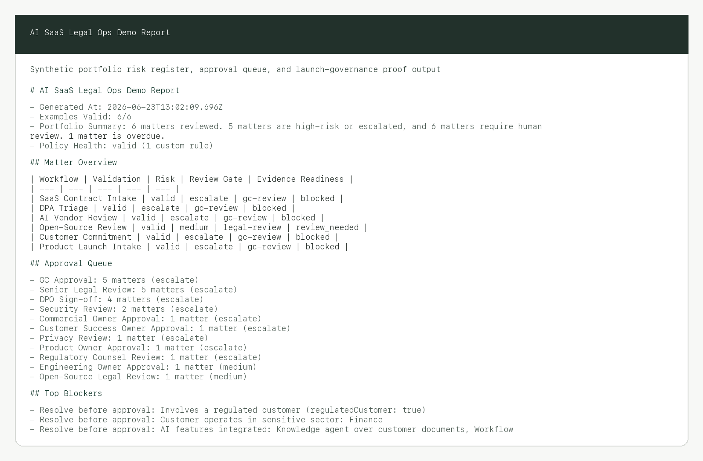

# ai-saas-legal-ops-starter-kit

[](https://github.com/sebastianfoerste/ai-saas-legal-ops-starter-kit/actions/workflows/ci.yml)

CI: passing. Deterministic test suite: 86 checks.

See [CASE_STUDY.md](CASE_STUDY.md) for the problem, controls, and limitations.

Public-safe legal operating layer for AI SaaS: contract intake, DPA triage, AI-vendor review, launch governance, approval-gated risk reporting. A TypeScript companion to [legal-function-operating-system](https://github.com/sebastianfoerste/legal-function-operating-system): it mirrors the same operating model, request routing, deterministic risk, and approval gates for the AI-SaaS legal stack. Not legal advice; data is synthetic.

> **If you don't code:** scroll to [What the demo produces](#what-the-demo-produces). This repo ships a sample output you can read in the browser. The point isn't the code; it's whether the legal work is structured, cited, reviewable, and testable.



## Run it

```bash
git clone https://github.com/sebastianfoerste/ai-saas-legal-ops-starter-kit
cd ai-saas-legal-ops-starter-kit
npm install && npm run build
node dist/src/cli.js
```

Runs end to end, offline and deterministically.

## What the demo produces

The demo compiles multiple matter payloads (contract, DPA, vendor reviews) into a portfolio risk register, highlighting approval queues, active blockers, and policy health. You can read the committed sample output: [`examples/launch-governance-report.md`](examples/launch-governance-report.md).

```markdown
# AI SaaS Legal Ops Demo Report

- Examples Valid: 6/6
- Portfolio Summary: 6 matters reviewed. 5 matters are high-risk or escalated, and 6 matters require human review. 1 matter is overdue.
- Policy Health: valid (1 custom rule)

## Matter Overview

| Workflow | Validation | Risk | Review Gate | Evidence Readiness |
| --- | --- | --- | --- | --- |
| SaaS Contract Intake | valid | escalate | gc-review | blocked |
| DPA Triage | valid | escalate | gc-review | blocked |
| AI Vendor Review | valid | escalate | gc-review | blocked |
| Open-Source Review | valid | medium | legal-review | review_needed |
| Customer Commitment | valid | escalate | gc-review | blocked |
| Product Launch Intake | valid | escalate | gc-review | blocked |
```

In the sample run, the self-serve templates and playbooks turn repeat legal work into a checklist a lawyer signs off, not re-drafts.

## What it checks / does

| Workflow / Area | Focus | Verification Method |
|---|---|---|
| SaaS Contract Intake | Deal terms check | Checks liability deviations and active red flags |
| DPA Triage | Privacy triage | Flags GDPR special categories, hosting regions, and subprocessors |
| AI Vendor Review | Third-party AI risk | Validates copyright indemnity, data use policies, and SOC 2 reports |

---

> **What workflow does this improve?** Recurring SaaS legal work (contracting, privacy, vendor triage).
> **Who is the user?** Legal Counsel, CSM Leads, and Product Managers.
> **Where does human review happen?** At the approval gate before matters are finalized or signed off.
> **What is blocked until approval?** Matters with high risk scores or unresolved blockers (e.g. at-risk customer commitments).
> **What would I tell Product?** To embed these JSON schemas directly into intake forms to automate validation.

## Portfolio Value

AI SaaS legal work repeats in structured patterns: sales terms, DPAs, model-provider terms, open-source licences, launch claims, customer commitments, and board reporting. This starter kit turns those patterns into typed intake payloads, deterministic checks, visible evidence gaps, approval records, and local audit trails. It is useful as a public-safe proof of how legal operations can become inspectable product infrastructure while final decisions remain human approved.

---

## Core Workflows

This starter kit covers 13 critical legal operations workflows:

1.  **SaaS Contract Intake**: Sales reps input deal terms. The workflow flags non-standard liability terms, regulated customers, or deployment changes.
2.  **DPA Triage**: Triage pipeline checking personal data scopes, GDPR special category data, subprocessor locations, and deletion SLAs.
3.  **AI Vendor Review**: Security, privacy, and model-provider review before external AI model providers or third-party APIs are integrated.
4.  **Open-Source Licence Review**: Review of copyleft licences, including AGPL-3.0, and compatibility against distribution models.
5.  **Customer Commitment Tracking**: Structured logging of custom obligations such as regional data residency or custom security terms.
6.  **Product Launch Legal Intake**: Pre-launch checklist matching product capabilities against marketing claims, privacy updates, and EU AI Act constraints.
7.  **Board Legal Risk Memo**: Leadership-level summary of active exposures, AI vendor status, and compliance posture.
8.  **Escalation Rules**: Deterministic routing when a matter requires General Counsel review.
9.  **Legal Action Plan Generation**: Converts validated payloads and risk scores into review queue artifacts with approvals, blockers, follow-ups, and evidence requirements.
10. **AI Governance Evidence Pack Generation**: Produces typed JSON and deterministic Markdown evidence packs for AI, product, privacy, and regulated-sector review.
11. **Legal Risk Register Reporting**: Aggregates multiple matters into a portfolio-level executive summary, approval queue, and remediation list.
12. **Contract Playbook Review**: Converts SaaS contract deviations into internal negotiation guidance and fallback positions.
13. **Self-Serve Demo CLI**: Produces end-to-end Markdown or JSON reports from the bundled public-safe example payloads.

---

## For AI Operator Platforms

For AI-native platforms running agents on customer data, the legal layer needs to move at product speed. This kit models legal workflows as reusable internal product infrastructure: self-serve where possible, escalated where necessary, and always auditable. It is especially relevant to contract intake agents, DPA triage, AI vendor review, customer commitment registers, product counsel routing, and board-ready risk reporting with human approval gates.

---

## Repository Map

```text
ai-saas-legal-ops-starter-kit/
  ├── README.md                           # Starter kit documentation and instructions
  ├── ROADMAP.md                          # Future expansion phases (UI, agent layer)
  ├── CONTRIBUTING.md                     # Data safety and testing contribution rules
  ├── LICENSE                             # MIT License
  ├── .gitignore                          # Git ignore configuration
  ├── package.json                        # NPM build and validation script definitions
  ├── dashboard/                           # Next.js legal portal for the self-serve GC demo
  ├── tsconfig.json                       # Compiler configurations
  ├── vitest.config.ts                    # Vitest test runner setup
  ├── src/                                # Core Legal Engineering Logic
  │   ├── cli.ts                          # End-to-end demo CLI
  │   ├── validate.ts                     # Ajv JSON Schema validator utility
  │   ├── risk-scoring.ts                 # Rules-based deterministic risk engine
  │   ├── action-plan.ts                  # Deterministic legal action plan generator
  │   ├── contract-playbook.ts            # SaaS contract playbook review generator
  │   ├── decision-packet.ts              # Reviewer packet and SHA-256 manifest generator
  │   ├── evidence-pack.ts                # AI governance evidence pack generator
  │   ├── regulatory-matrix.ts            # Regulatory obligation matrix generator
  │   ├── risk-register.ts                # Portfolio-level risk register summary
  │   ├── storage.ts                      # Safe local matter persistence and transitions
  │   ├── workflows.ts                    # Shared schema allowlist and root resolver
  │   └── index.ts                        # Main library exports
  ├── schemas/                            # JSON Schema Definitions
  │   ├── saas-contract-intake.schema.json
  │   ├── dpa-triage.schema.json
  │   ├── ai-vendor-review.schema.json
  │   ├── open-source-review.schema.json
  │   ├── customer-commitment.schema.json
  │   └── product-launch-intake.schema.json
  ├── examples/                           # Synthetic & Public-Safe JSON Payloads
  │   ├── saas-contract-intake.example.json
  │   ├── dpa-triage.example.json
  │   ├── ai-vendor-review.example.json
  │   ├── open-source-review.example.json
  │   ├── customer-commitment.example.json
  │   └── product-launch-intake.example.json
  ├── templates/                          # Self-Serve Markdown Templates
  │   ├── saas-contract-intake.md
  │   ├── dpa-triage.md
  │   ├── ai-vendor-review.md
  │   ├── open-source-licence-review.md
  │   ├── customer-commitment-register.md
  │   ├── product-launch-legal-intake.md
  │   ├── board-legal-risk-memo.md
  │   └── escalation-note.md
  ├── policies/                           # Operational Policies & Playbooks
  │   ├── escalation-rules.md             # Routing rules to GC
  │   ├── human-review-policy.md          # Oversight mandates
  │   ├── data-boundary-policy.md         # Synthetic data boundaries
  │   └── ai-vendor-use-policy.md         # Permitted, restricted, and prohibited AI vendor uses
  ├── docs/                               # Developer Guides & Briefs
  │   ├── architecture.md                 # System flow chart and pipeline design
  │   ├── api.md                          # Output contracts and local import examples
  │   ├── launch-readiness.md             # Production launch checklist
  │   ├── operating-model.md              # Shift from ticket queues to products
  │   ├── recruiter-brief.md              # Brief: What this repository proves
  │   ├── founder-brief.md                # Brief: Legal as product infrastructure
  │   ├── demo-output.md                  # Illustrative validation/test output logs
  │   ├── screenshots.md                  # UI and terminal visualization references
  │   └── demo-script.md                  # 5-minute review walkthrough
  └── tests/                              # Vitest Test Scaffolding
      ├── schema-validation.test.ts       # Automated schema-compliance verification
      ├── risk-scoring.test.ts            # Triage scoring unit tests
      ├── policy-health.test.ts           # Custom policy health and resolver tests
      ├── action-plan.test.ts             # Legal action plan unit tests
      ├── cli.test.ts                     # End-to-end demo CLI tests
      ├── contract-playbook.test.ts       # SaaS contract playbook tests
      ├── decision-packet.test.ts         # Reviewer packet and manifest tests
      ├── evidence-pack.test.ts           # AI governance evidence pack tests
      ├── package-smoke.test.ts           # Package metadata tests
      ├── regulatory-matrix.test.ts       # Regulatory matrix coverage tests
      ├── storage-safety.test.ts          # Persistence boundary tests
      └── risk-register.test.ts           # Portfolio register unit tests
```

---

## 90-Second Evaluator Path

Verify validation, scoring, action planning, approval gates, evidence packs, and risk register compliance:

```bash
npm install
npm run test
npm run typecheck
npm run demo:json
node dist/src/cli.js export-decision --type ProductLaunchIntake --input examples/product-launch-intake.example.json --approval-records examples/product-launch-approval-records.example.json --format json
```

In the final command, inspect `approvalGate.exportAllowed`. The bundled synthetic approval records intentionally leave legal approvals open, so export remains blocked until the required human approvals are present.

For the full walkthrough, use [demo-script.md](demo-script.md).

## Dust GC Demo Path

This repository now includes a synthetic Dust-style General Counsel demo. It shows how a first legal hire at an AI-native SaaS company can turn commercial contracting, DPA review, AI vendor governance, customer commitments and product launch review into a structured legal operating layer.

Run the core validation path:

```bash
npm install
npm run validate:examples
npm run test
npm run typecheck
npm run demo
```

Run the self-serve legal portal:

```bash
npm --prefix dashboard install
npm run dashboard:dev
```

Open `http://localhost:3000`, then use `Seed Dust demo`. The dashboard loads six public-safe synthetic matters:

1. regulated enterprise SaaS MSA,
2. DPA and transfer review,
3. zero-data-retention AI vendor review,
4. open-source SDK licence review,
5. customer commitment register item,
6. regulated product launch gate.

The five-minute reviewer path is simple: seed the demo, open the MSA or product launch matter, inspect risk reasons, evidence gaps, playbook fallback positions and audit history, then switch to the General Counsel role and record an approval or rejection note. No external communication is sent and no real customer data is used.

The dashboard also exposes policy health, regulatory matrix gaps, and local decision packets. Packet copy/download behavior remains local to the browser and CLI. There is no external send, publication, filing, or customer communication action.

## Output contracts

Every workflow emits a typed, deterministic result: risk decision, action plan,
evidence pack, regulatory matrix, decision packet, contract playbook, and portfolio
risk register. Full schemas and example payloads: **[docs/api.md](docs/api.md)**.

---

## Human Review Rule

> [!IMPORTANT]
> **No automated workflow produces final legal advice.** Consequential decisions, contract execution, and regulatory filings require direct validation by a qualified human lawyer or the accountable internal owner defined in [human-review-policy.md](policies/human-review-policy.md).

---

## Public Safety Note

All inputs, examples, and test data in this repository are **strictly synthetic and public-safe**. They contain no client data, personal data, commercial secrets, or privileged legal communication. See [data-boundary-policy.md](policies/data-boundary-policy.md).

The sample outputs under `examples/` are static synthetic snapshots for evaluator review. They are designed to show the board risk register, blockers, approvals, evidence requests, approval-gate status, and audit-trail structure without connecting to live systems.

---

## Package and Supply-Chain Gates

The local library package is importable from `dist/src/index.js` and exposes an explicit `exports` map. If it is packed or published later, package contents are limited through `files` to built library output, schemas, examples, policies, templates, docs, README, and license material. Tests, dashboard source, local storage, and repository planning artifacts stay out of the package tarball.

Run the package smoke and dry-run pack check:

```bash
npm run check:package
```

CI also runs `npm audit --omit=dev` for the root package and a dashboard production audit gate. The dashboard currently has a documented moderate advisory through `next@16.2.7` to bundled `postcss@8.4.31` (`GHSA-qx2v-qp2m-jg93`). The check allows only that known path and fails on any unknown production advisory. Do not use `npm audit fix --force`; it suggests an unsafe Next downgrade. Resolve through a safe Next/PostCSS upgrade path when available.

---

## Relevance for AI-Native SaaS Companies

AI-native platforms process significant amounts of client data through external model APIs. This repository implements governance infrastructure designed to:

*   Enforce EU data-boundary positions by ensuring vector and API requests do not fail over to unapproved hosting regions.
*   Prevent model contamination by blocking vendors who train base models on prompt inputs.
*   Classify releases under incoming legislation such as the EU AI Act.
*   Preserve a customer commitment register so sales, product, security, and legal know which promises have been made.

---

## How to Run

1.  Install Node.js v18+ and npm.
2.  Install dependencies:
    ```bash
    npm install
    ```
3.  Run tests:
    ```bash
    npm run test
    ```
4.  Run type check:
    ```bash
    npm run typecheck
    ```
5.  Run the end-to-end demo report:
    ```bash
    npm run demo
    npm run demo:json
    ```

---

## License

This repository is licensed under the **MIT License**. See [LICENSE](LICENSE) for details.

## Human-authored legal judgment
AI tools assisted the implementation, but the parts that carry the value are
human-authored: the JSON schemas, the risk-scoring rules, the escalation policies,
and the regulatory-obligation mappings. The point of this repository is not code volume; it is showing
how legal judgment can be made structured, testable, and reviewable.

## Why this matters for AI SaaS
AI SaaS legal work is not just contract review — it is customer commitments, data
protection, vendor review, model governance, launch approvals, security
questionnaires, and board reporting. The value is the operating layer around those
decisions, which is what this kit models.

## Known limitations
Public-safe templates and triage over synthetic inputs.
1. Templates are starting points, not firm-specific precedent.
2. Not integrated with a real CLM, ticketing, or analytics backend.
3. Playbook thresholds are illustrative defaults.
Next production step: connect intake to a real channel, wire the DPA checks to
`dpa-and-data-transfer-review`, and add the `legal-function-operating-system` board pack.
