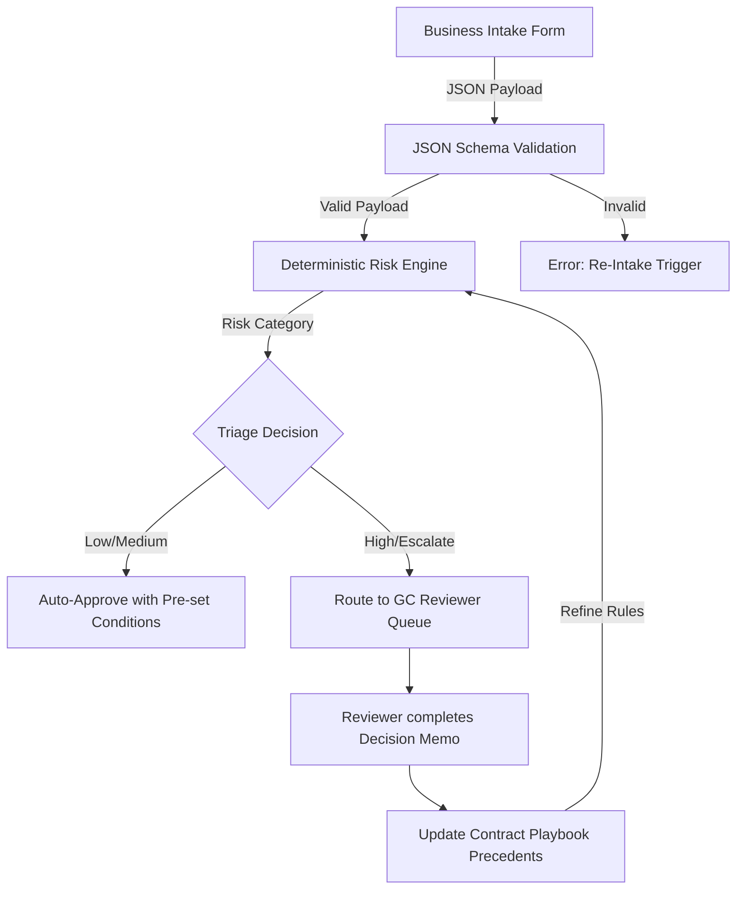

# System Architecture: Legal Operations Triage Pipeline

This document describes the flow and architecture of the automated legal operations system. The goal is to treat legal intakes as structured data that can be parsed, validated, and programmatically scored for risk.

## System Components

### 1. Intake
Business users complete markdown templates (e.g. `saas-contract-intake.md`) or submit structured JSON payloads representing contract reviews, DPA requests, or vendor evaluations.

### 2. Validation (`src/validate.ts`)
The payload is validated against strict JSON schemas (located in `schemas/`). This prevents missing fields, incorrect data formats, or poorly structured requests from reaching the legal queue.

### 3. Deterministic Risk Scoring (`src/risk-scoring.ts`)
The validated payload is evaluated by a rules-based scoring engine. It inspects key data points (e.g. data residency commitments, regulated customer sectors, AI model training clauses) and computes a risk rating:
*   `low`: Low risk, automated sign-off or self-serve playbook instructions.
*   `medium`: Minor issues, reviewer checks custom details.
*   `high`: Critical deviations, requires senior counsel sign-off.
*   `escalate`: Triggers immediate routing to the General Counsel (`sebastianfoerste`).

### 4. Reviewer Queue & Escalation Note
If a matter escalates, the system generates an `escalation-note.md` structure pre-filled with the trigger reasons and raw payload details.

### 5. Playbook Update
Any custom compromise approved by the GC updates our codebase: schemas are refined, new exceptions are coded into the risk engine, and templates are updated.
