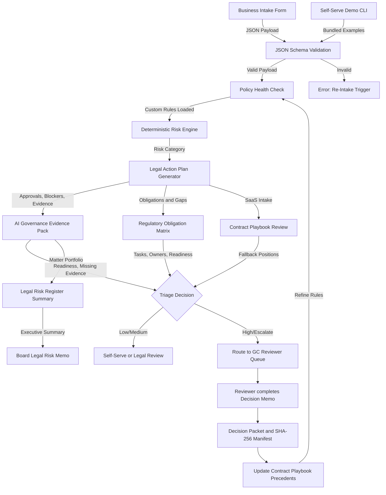

# System Architecture: Legal Operations Triage Pipeline

This document describes the flow and architecture of the automated legal operations system. The goal is to treat legal intakes as structured data that can be parsed, validated, and programmatically scored for risk.

## System Components

### 1. Intake
Business users complete markdown templates (e.g. `saas-contract-intake.md`) or submit structured JSON payloads representing contract reviews, DPA requests, or vendor evaluations.

### 2. Self-Serve Demo CLI (`src/cli.ts`)
The CLI reads bundled public-safe schemas and examples, validates them, runs deterministic risk scoring, generates action plans and evidence packs, aggregates the legal risk register, and prints Markdown or JSON. It provides a fast demo path without external APIs, databases, or UI infrastructure.

### 3. Validation (`src/validate.ts`)
The payload is validated against strict JSON schemas (located in `schemas/`). This prevents missing fields, incorrect data formats, or poorly structured requests from reaching the legal queue.

### 4. Policy Health and Deterministic Risk Scoring (`src/risk-scoring.ts`)
The policy loader resolves `policies/rules.json` from the package root, root cwd, dashboard cwd, built `dist/`, and tests. Missing custom policy files are explicit and non-fatal. Invalid JSON, invalid shape, and unsupported operators fail visibly. The validated payload is then evaluated by a rules-based scoring engine. It inspects key data points (e.g. data residency commitments, regulated customer sectors, AI model training clauses) and computes a risk rating:
*   `low`: Low risk, automated sign-off or self-serve playbook instructions.
*   `medium`: Minor issues, reviewer checks custom details.
*   `high`: Critical deviations, requires senior counsel sign-off.
*   `escalate`: Triggers immediate routing to the General Counsel (`sebastianfoerste`).

### 5. Legal Action Plan (`src/action-plan.ts`)
The validated payload and risk score are converted into an operational review package. The action plan includes the review gate, priority, next action, required approvals, blockers, follow-ups, evidence to collect, and an audit trail. This makes the output immediately usable in a legal review queue or internal SaaS workflow.

### 6. AI Governance Evidence Pack (`src/evidence-pack.ts`)
Product launch, AI vendor, and DPA matters are mapped to structured evidence requirements. The evidence pack covers EU AI Act, GDPR, NIST AI RMF, ISO/IEC 42001, conditional DORA signals, and internal-policy controls. It produces both typed JSON and deterministic Markdown for reviewer queues, demos, and board-pack preparation.

### 7. Regulatory Obligation Matrix (`src/regulatory-matrix.ts`)
The regulatory matrix turns each matter into obligation rows with framework, trigger, source fields, evidence required, owner, review gate, readiness, and rationale. It covers AI Act role classification, prohibited-practices screening, high-risk Annex III screening, GPAI evidence, Article 50 transparency, DORA register fields, GDPR DPIA and TIA outputs, Data Act switching clauses, Cyber Resilience Act software evidence, and OWASP GenAI controls where applicable.

### 8. Contract Playbook Review (`src/contract-playbook.ts`)
SaaS contract intakes are mapped to deterministic negotiation guidance. The review identifies clause deviations, non-starters, fallback positions, approval requirements, and reviewer notes for liability, audit rights, AI data use, subprocessor notice, data residency, IP ownership, service levels, and termination terms.

### 9. Decision Packet (`src/decision-packet.ts`)
The decision packet generator produces a local reviewer export containing source payload, validation result, risk reasons, action plan, evidence pack, regulatory matrix, contract playbook deviations where applicable, reviewer note, transition history, human-review notice, and SHA-256 section manifest. The packet is a local artifact only.

### 10. Legal Risk Register (`src/risk-register.ts`)
Multiple matters can be aggregated into a portfolio-level register. The register counts exposure by risk level and review gate, identifies overdue matters, builds approval queues, surfaces top blockers, and generates recommended actions for executive review.

### 11. Reviewer Queue & Escalation Note
If a matter escalates, the system generates an `escalation-note.md` structure pre-filled with the trigger reasons and raw payload details.

### 12. Playbook Update
Any custom compromise approved by the GC updates our codebase: schemas are refined, new exceptions are coded into the risk engine, and templates are updated.
